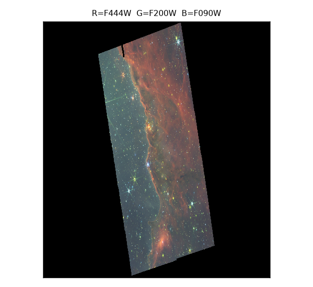

# jwst_stack



*NGC 3324 (Carina Nebula) from JWST NIRCam program 2731. 640 calibrated
exposures across six filters, stacked independently and validated against
MAST's own drizzle products. R = F444W, G = F200W, B = F090W.*

An independent astrometric reduction pipeline for JWST NIRCam. It
reprojects Level-2 exposures onto a shared WCS grid, registers them against
each other by star matching, sigma-clips and combines them into deep mosaics,
and measures what it achieved by comparing its own stars to NASA's published
`*_i2d.fits` products.

The point is the **measurement**. Every number below is a residual against an
external reference, not a self-consistency score — which is what makes the
failures interesting rather than hidden.

## Results

Median stellar offset between this pipeline's mosaics and the official MAST
combined `i2d` for each filter, from 5,400–5,900 matched stars:

| filter | frames | median offset | in arcsec | within 0.5 px |
|--------|--------|---------------|-----------|--------------|
| F187N   | 160 | **0.0647 px** | 0.00202" | 99.3% |
| F200W   | 160 | **0.0730 px** | 0.00228" | 99.0% |
| F444W;F470N | 40 | **0.0818 px** | 0.00515" | 98.4% |
| F335M   | 40 | **0.1000 px** | 0.00629" | 98.7% |
| F444W   | 40 | **0.1034 px** | 0.00650" | 98.4% |
| F090W   | 160 | 0.1384 px | 0.00432" | 78.5% |

The three short-wave filters are at their native 0.031"/px; the three
long-wave ones at 0.063"/px, which is why their pixels are ~2x larger and
their arcsec accuracy ~2.5–3x worse. F090W is the outlier in pixels because
of a per-detector pointing term described below.

Each filter's gauge is measured independently against that filter's own `i2d`
before solving. That is deliberate: the correction is *relative*, so gauging it
to the internal consensus of the visits would drive the reported residual to
~0 by construction and destroy the evidence.

## Two things worth reading about

**There is a ~0.05 px floor that is not noise.** Splitting the F200W and F187N
residuals into a per-detector step and an intra-detector field term accounts for
roughly half of each, and the two independently measured leftovers — 0.0508 px
and 0.0485 px — agree to 5% across filters differing 5x in brightness. That
consistency says systematic, not scatter, but the cause is not characterised.
Candidates are the per-star centroid floor and PSF-difference bias against the
drizzle. It is the largest open term in the project.

**A 0.79 px "grid convention difference" was our own bug.** The first mosaic
sat 0.79 px from the official i2d. That was plausible enough to accept as a
drizzle-convention offset for a round. It was wrong: the per-group registration
registered each `(visit, detector)` group against its own first exposure, so
nothing ever compared one visit to another, and 0.81 px of inter-visit pointing
error passed straight into the mosaic. The within-visit result looked excellent
throughout, which is exactly what made it hard to see — a pipeline that is
self-consistent and globally wrong is the failure mode this project is
structured to catch. Fixing it required a second cross-visit alignment stage,
and it is why the gauge is now measured against an external reference.

Neither finding is a solved problem. Both are recorded in full, with the
numbers that constrain them, in `AGENTS.md`.

---

## Technical detail

Everything below is the working reference: what the code does, how to run it,
and the traps. The pipeline is described first, then the full command reference.

### Original scope

Stack JWST NIRCam calibrated exposures (`*_cal.fits`, Level 2) into a single
deeper image per visit. Frames are reprojected onto a common grid by WCS, then
fine-aligned to each other by **photutils star registration** (translation-only,
sub-pixel). Use `--no-register` to reproduce the pure-WCS behaviour.

Built for program **2731** (NGC 3324, Carina Nebula), NIRCam **F200W**,
detector **nrca1**, 20 exposures = 4 visits x 5 dithered frames.

That was the starting point — one filter, one detector, one visit stack. The
sections below are that original pipeline; the six-filter, 640-exposure,
all-detector results at the top of this file are where it ended up, via the
Stage 4 `mosaic` and Phase 4 colour work described under
[Full 8-detector mosaic](#full-8-detector-mosaic-stage-4) and in `AGENTS.md`.

### Data expectations

- Files named `jw02731*_nrca1_cal.fits`, one per subfolder under the input
  directory.
- Each `.fits` has `SCI` (float32, `MJy/sr`), `ERR`, `DQ` (with standard JWST
  flag bits), plus `VAR_*`/`AREA`/`ASDF` extensions.
- The `SCI` header carries a complete `RA---TAN-SIP` FITS WCS (order-4 SIP)
  that `reproject` consumes directly.
- The files are already dark-subtracted, flat-fielded and flux-calibrated.
  **No darks or flats are applied.**

### Install

```
python -m venv .venv
.\.venv\Scripts\pip install -r requirements.txt
```

Requirements: `numpy`, `astropy`, `reproject`, `scipy`, `photutils`,
`matplotlib`, `pytest`. The heavy `jwst` package is **not** required.

### Usage

```
.\.venv\Scripts\python -m jwst_stack.cli <command> [options]
```

| command   | purpose                                                        |
|-----------|----------------------------------------------------------------|
| `inspect` | print filename / visit / exposure / RA / Dec / pixel scale     |
| `group`   | report footprint-overlap groups + pair-wise overlap fractions  |
| `stack`   | register, align and sigma-clip stack one visit (or all)        |
| `compare` | reproject an official `*_i2d.fits` onto a stack and compare    |
| `grid`    | build/describe the fixed common output grid                     |
| `mosaic`  | Stage 4: all 8 detectors x 4 visits on the fixed grid           |
| `download`| MAST product discovery and resumable download                  |
| `verify`  | compare the data roots against the MAST plan, rebuild manifests |

Common options: `--input-dir` (default
`C:\data\jwst_cal\mastDownload\JWST`), `--outdir` (default `out`).

Registration options (all on `stack`): `--no-register` to skip star
registration, plus `--fwhm-px`, `--match-radius-arcsec` (default 0.1" ~ 3 px),
`--threshold-sigma`, `--bg-sigma` and `--interp-order` (default 3, cubic) to
tune detection, matching and resampling. `inspect`, `group` and `stack` all
accept `--detector` and `--filter`, which are required to avoid silently
mixing detectors in one stack.

### Examples

```
# 1. table of all 20 files
python -m jwst_stack.cli inspect

# 2. overlap groups (writes out/overlap_groups.txt)
python -m jwst_stack.cli group --threshold 0.15

# 3. stack one visit (star registration on by default)
python -m jwst_stack.cli stack --visit 1

# 4. stack all four visits, tuned clipping
python -m jwst_stack.cli stack --visit all --sigma 3.0 --iterations 3 --combine median

# 5. slower, more exact flux-preserving reprojection
python -m jwst_stack.cli stack --visit 1 --method exact

# 6. same stack without star registration (pure-WCS alignment)
python -m jwst_stack.cli stack --visit 1 --no-register

# 7. compare a stack against NASA's official mosaic
python -m jwst_stack.cli compare --stack out\jw02731001001_02105_00001_nrca1_stack.fits --i2d path\to\jw02731001001_02105_00001_nrca1_i2d.fits --outdir out
```

### Full 8-detector mosaic (Stage 4)

`stack` cannot take all 160 F200W frames at once - the in-memory stack would
need ~225 GB. `mosaic` streams 1024-px tiles through memmapped scratch instead,
so it runs in ~4.5 GB of RAM.

```
# 1. build the fixed output grid (once)
python -m jwst_stack.cli grid --build --out out\grid.fits

# 2. report the resource envelope without writing anything
python -m jwst_stack.cli mosaic --detector nrca1 nrca2 nrca3 nrca4 nrcb1 nrcb2 nrcb3 nrcb4 --filter F200W --plan-only

# 3. build it (registration on by default; ~38 min + ~37 min)
python -m jwst_stack.cli mosaic --detector nrca1 nrca2 nrca3 nrca4 nrcb1 nrcb2 nrcb3 nrcb4 --filter F200W --grid out\grid.fits --out out\f200w_all_detectors_mosaic.fits --registration out\mosaic_registration.json --scratch-dir out

# 4. validate against the official combined i2d, tile by tile
python -m jwst_stack.cli compare --tiled --stack out\f200w_all_detectors_mosaic.fits --i2d "C:\data\jwst_i2d\mastDownload\JWST\jw02731-o001_t017_nircam_clear-f200w\jw02731-o001_t017_nircam_clear-f200w_i2d.fits" --outdir out --write-diff
```

The registration solve is cached in `out\mosaic_registration.json`, so re-running
the build reuses it. Pass `--recompute-registration` to redo it. `--plan-only`
prints tiles, scratch size, frame counts and free disk without touching disk.

### Stack behaviour

- Each exposure is masked to `NaN` where the DQ `DO_NOT_USE` bit (bit 0) is
  set or the value is `NaN`/`inf`, then reprojected onto a common plain-TAN
  grid built from the union of the five footprints (source pixel scale and
  orientation, 32-px margin).
- Reprojected overlays are then **star-registered** against the first exposure
  of the visit (the reference): `DAOStarFinder` detects sources at
  `threshold_sigma` times the robust MAD noise, stars are matched to the
  reference with a KD-tree within `--match-radius-arcsec`, and the shift is the
  robust median of the matched offsets, applied with `scipy.ndimage.shift`
  (order 1, so sub-pixel). A frame needs >= 3 matches to be shifted; otherwise
  it is left at its WCS position.
- Each shifted frame also has an additive, sigma-clipped **background offset**
  removed (median over the overlap). Offsets and slopes are deliberately *not*
  fitted, so the NGC 3324 nebular gradient is preserved.
- Every visit writes `registration.json` (per-frame dx, dy, n_detected,
  n_matched, residual rms/max in pixels, background offset) and a
  `registration_report.txt` summary next to the stack, so seams and residuals
  are auditable.
- Frames are combined with a NaN-aware `sigma_clip` (median or mean,
  `astropy.stats`) over the frame axis. With fewer than 3 valid frames at a
  pixel the plain median/mean of the valid values is used instead of
  clipping, which keeps the 2- and 3-frame overlap regions sensible.
- Output FITS: a `PRIMARY` HDU with the science stack (float32, `MJy/sr`) and
  a full WCS header, plus a `COVERAGE` HDU counting contributing frames per
  pixel. An asinh-stretched PNG preview with percentile clipping is written
  alongside.
- Memory: one 2048x2048 SCI image is held at a time, plus its reprojected
  copy; never all 20 frames.

### Geometry of this dataset

The five dithers within a visit are large (~20 arcsec RA / ~25 arcsec Dec in
a ~64 arcsec field), so per-visit depth runs from 2 to 5 frames. The four
visits point at different fields; at a 15% footprint-overlap threshold they
form **two groups** on the sky:

- group 1: visits 1 + 4 (10 frames)
- group 2: visits 2 + 3 (10 frames)

There is no single all-20 region of uniform coverage; `group` reports the
exact numbers.

### WCS accuracy note

`reproject` here uses the FITS-header WCS (`RA---TAN-SIP`, order 4), which is
the flattened approximation of the true NIRCam distortion model that the
calibration pipeline stores as a gwcs in the `ASDF` extension. The header WCS
is good to well under a pixel on its own, but across a 5-frame dither the
residual pointing differences still smear stellar profiles and leave visible
seams in the stack.

Star registration measures and removes what the WCS leaves behind. Within a
single visit the solved per-frame shifts are small (median 0.07-0.38 px, i.e. the
header WCS is already good to ~0.1 px), so the effect on stellar FWHM is
neutral (within 0.05% over 100 stars per visit). Its real value is that the
residual pointing error becomes *measured and auditable* instead of unknown,
and that the shifts are applied with a cubic spline rather than left as a
random PSF-broadening term: applying the same shifts with linear interpolation
instead costs ~5% wider FWHM on visit 1, because a global first-order resample
of every frame blurs it.

**That ~0.1 px figure is a within-visit result only.** It must not be read as
dataset-wide astrometric accuracy. Across visits the header WCS is off by
0.8115 px (visit 1 versus the mean of visits 2/3/4), which no per-visit stack
ever sees because each `stack` run is single-visit. Only the Stage 4 `mosaic`
spans visits, so it runs a separate cross-visit alignment stage that registers
all 32 `(visit, detector)` groups to each other and solves one translation per
visit. On this dataset that stage finds 26 usable cross-visit group edges and
resolves to 0.071/0.076 px rms per axis internally, and 0.0730 px median stellar
offset against the official combined i2d. Pass `--no-cross-visit` to `mosaic`
to skip it and reproduce the pre-fix behaviour.

That correction is *relative*, so its absolute origin is a choice, and
`mosaic` records it as `gauge_source` in the registration JSON. The default
(lowest-numbered visit) is a heuristic that is correct for F200W only because
that filter's official i2d was measured to agree with visit 1's header WCS to
0.010 px. That is a per-filter fact, not a convention, so for any other filter
measure the raw frame WCSs against that filter's i2d first and pass
`--gauge-visit` explicitly. Gauging to the largest agreeing set of visits
instead is a real failure mode: the result is internally self-consistent and
still a full inter-visit error away from the reference.

**Per-visit translation is a floor, not a cure.** All three 160-frame filters
have now been run through this procedure with the gauge measured independently
against each filter's own combined i2d, and none of them reaches zero:

| filter | inter-detector term | intra-detector field term | measured median offset vs i2d | within 0.5 px |
|--------|--------------------|--------------------------|-------------------------------|--------------|
| F090W | 0.1118 px | 0.0927 px rms | 0.1384 px | 78.5% |
| F200W | 0.0337 px | 0.0401 px rms | 0.0730 px | 99.0% |
| F187N | 0.0290 px | 0.0316 px rms | 0.0647 px | 99.3% |

F090W is dominated by a large per-detector step that is *not identifiable*
internally: every edge in the overlap graph joins two different visits and two
different detectors (0 same-visit, 0 same-detector edges), so visit and detector
offsets are confounded. Correcting to the i2d would drive the reported offset to
~0 by construction and destroy the evidence, so don't. A second, smaller term is
a rotation/skew within each detector's field; it *is* identifiable from internal
dither matches and is the part a future rotation-aware fit would remove. F200W
and F187N both leave ~0.05 px unexplained after subtracting their two measured
terms, which looks like a common systematic in this comparison rather than
noise - it is not characterised. See `AGENTS.md` for the full numbers.

Registration is translation-only by design -- no rotation, skew or scale --
because the dithers are pure translations and distortion residuals are
already handled by the WCS.

If sub-pixel *distortion* accuracy across the full frame still matters, the
gwcs is available from the `ASDF` extension but requires `jwst` or
`stdatamodels` to load it; that is a deliberate, optional upgrade.

### Tests

```
.\.venv\Scripts\python -m pytest -q tests
```

Synthetic tiny FITS images with known pixel offsets verify that reprojection
aligns frames onto the common grid and that sigma clipping removes injected
outliers; nan-aware masking and small-overlap fallback are covered too.
`tests/test_register.py` drives the real photutils detection / matching /
translation solve / background-offset engine on synthetic frames with known
integer and sub-pixel shifts, and checks the JSON and text reports.
`tests/test_mosaic.py` covers the Stage 4 tiled builder end to end on synthetic
frames: tile iteration, bounding boxes, the registration shift sign and NaN
masking, sigma-clip combination, the pre-flight plan, JSON round-tripping, the
cross-visit translation solve (gauge choice, edge rejection, known-offset
recovery), and the tiled validation metrics. `tests/test_color_build.py`
covers the Phase 4 tiled colour builder end to end on synthetic mosaics: the
measured backgrounds and shared stretch, band identity (each RGB band is the
stretch of exactly its own channel), per-channel background subtraction, holes
written as 0, the cross-channel mask (a pixel missing any RGB band is black,
not magenta), the BZERO 32768 uint16 convention, row-size invariance, the
preview path, and that a rebuild truncates its products instead of appending
to a stale file, plus the export of the band-first `(3, ny, nx)` viewer cube.
**294 tests, all offline, no FITS data required.

### Layout

```
jwst_stack/
  io.py        discovery + lazy loading + DQ masking
  grouping.py  frame table, overlap fractions, connected groups
  align.py     output-grid construction + reprojection (interp/exact)
  register.py  photutils star detection, matching, translation solve
  stack.py     registration + sigma-clip combination
  mosaic.py    Stage 4 tiled streaming builder + pre-flight planner
  validation.py tiled comparison against the official i2d mosaic
  plotting.py  asinh PNG previews + i2d comparison metrics
  cli.py       argparse front end (inspect | group | stack | compare |
               grid | mosaic | download | verify | color-psf |
               color-register | color-build | color-viewer)
tests/
  test_align.py, test_stack.py, test_register.py, test_mosaic.py,
  test_color.py, test_color_build.py
```

